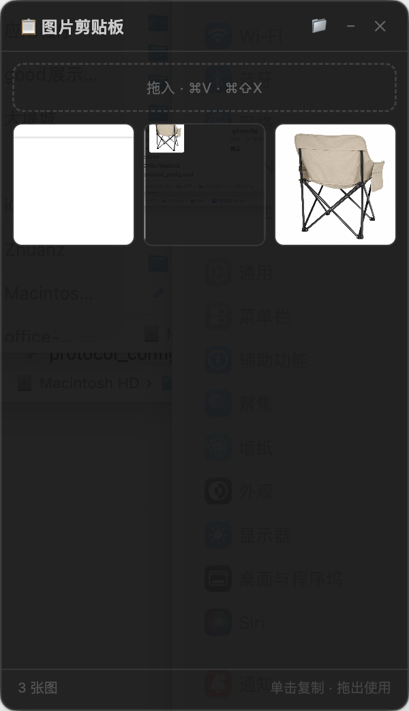

# 图片剪贴板

一个 macOS 浮动图片剪贴板工具，截图/复制的图片自动出现在面板，随时单击复制或拖出使用。

<p align="center">
  
</p>

## 功能

- **自动捕获截图** — 使用 Mac 自带截图（⌘⇧3/⌘⇧4），图片自动进入面板
- **⌘⇧X 快速截图** — 应用内快捷键，框选截图直接保存
- **⌘V 粘贴** — 将剪贴板中的图片存入面板
- **拖入图片** — 从 Finder 或浏览器拖入图片
- **单击复制** — 点击缩略图上的复制按钮，图片回到剪贴板
- **拖出使用** — 直接把缩略图拖进其他 App
- **浮动置顶** — 窗口始终显示在最上层，切换 App 也不会消失

## 安装

### 直接下载

前往 [Releases](https://github.com/zemei641-ship-it/image-staging-board/releases/latest) 下载对应平台的文件：

| 平台 | 文件 | 说明 |
|------|------|------|
| **macOS** (Apple Silicon) | `图片剪贴板-x.x.x-arm64.dmg` | 打开 DMG，拖入 Applications |
| **Windows** (x64) | `图片剪贴板-x.x.x-win-x64.zip` | 解压后运行 `图片剪贴板.exe` |

> **macOS 注意**：未签名应用首次打开需右键 → 打开，或执行：
> ```bash
> xattr -cr /Applications/图片剪贴板.app
> ```

### 用 AI 一键安装

把仓库链接发给 Claude Code 并说「帮我安装这个」，AI 会自动完成克隆、依赖安装和启动。

### 从源码运行

```bash
git clone https://github.com/zemei641-ship-it/image-staging-board.git
cd image-staging-board
npm install
npm start
```

需要 Node.js 18+ 和 npm。

## 截图保存位置

所有图片保存在 `~/Pictures/ImageClipboard/`，可点击工具栏 📁 按钮直接打开。

## 技术栈

- Electron 35
- chokidar（文件监听）
- 原生 macOS clipboard API

## License

MIT
